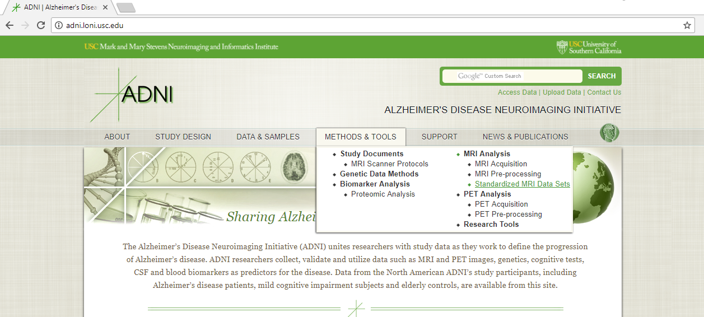
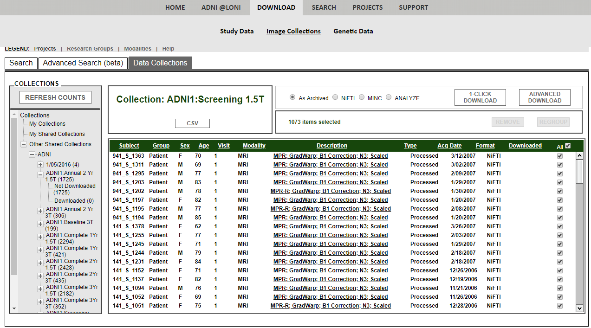

# [ADNI 数据获取](http://adni.loni.usc.edu/)
**注册过程** 
1. 请访问ADNI["Access Data"](http://adni.loni.usc.edu/data-samples/access-data/)页面。  
  
1. 点击ADNI按钮、填写你的信息并提交，以完成注册过程。
1. 然后需要大约为期一周的申请审查过程。

**标准MRI数据集** 
1. 获取ADNI数据访问权限后，请访问["Standardized MRI Data Sets"](http://adni.loni.usc.edu/methods/mri-analysis/adni-standardized-data/)页面。  
  
1. 请参考“How to Download”部分以获得图像集合和研究信息。
1. 本项目使用全部1.5权重的图像集合。
  
图像集合列表：
   1. `ADNI1:Annual 2 Yr 1.5T`
   1. `ADNI1:Complete 1Yr 1.5T`
   1. `ADNI1:Complete 2Yr 1.5T`
   1. `ADNI1:Complete 3Yr 1.5T`
   1. `ADNI1:Screening 1.5T`
1. 本项目使用`ADNI 1.5Y MRI Standardized Lists`和`Key ADNI tables merged into one table`两个研究信息列表。

----

# 研究信息
列表`ADNI 1.5Y MRI Standardized Lists`包含全部五个图像集合数据信息，表格的一部分见下表。

|RID|Image.ID|PTID|Screen.Diagnosis|Visit|Scan.Date|Sequence|Study.ID|Series.ID|
|:----:|:----:|:----:|:----:|:----:|:----:|:----:|:----:|:----:|
|2|35475|011_S_0002|NL|Screening|8/26/05|MPR; GradWarp; B1 Correction; N3; Scaled|1945|9107|
|3|32237|011_S_0003|AD|Screening|2009/1/5|MPR-R; GradWarp; B1 Correction; N3; Scaled|1948|9127|

`Screen.Diagnosis`栏显示每个影像的诊断结果。项目中只使用`NL`和`AD`主体的影像，并没用使用`MCI`主体的影像数据。`Screen.Diagnosis`栏也是深度学习模型的数据标签。`Sequence` 显示ADNI影像修正操作。请参考["MRI Pre-processing"](http://adni.loni.usc.edu/methods/mri-analysis/mri-pre-processing/)页面以获取详细信息，这会影响项目中的预处理流程。

列表`Key ADNI tables merged into one table`包含ADNI的全部主体信息，这将被用于主体分组。比如，研究纯粹非阿尔兹海默症（NL）和阿尔兹海默症（AD）主体的数据，由（NL）转变为（AD）的主体数据不会被采用，这就需要依据`Key ADNI tables merged into one table`列表，查找主体的历史诊断信息。
